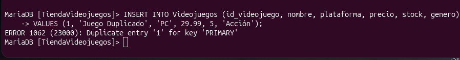
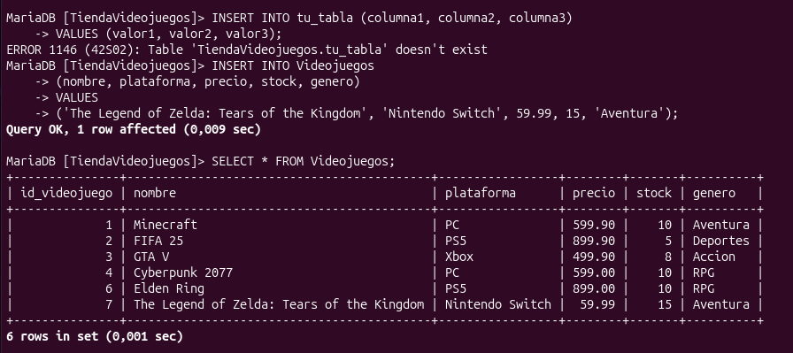

# 🗄️ Práctica 04 — ¡MODIFIQUEMOS LOS DATOS SIN ROMPER LA BASE!

## 🧪 Experimento 1 — Insertar un registro

### 💭 Analiza

¿Qué registro agregaste?
Agregué el videojuego "The Legend of Zelda: Tears of the Kingdom" con plataforma "Nintendo Switch", precio de 59.99, un stock de 15 y género "Aventura".

¿Qué columnas especificaste?
Especificé explícitamente las columnas `nombre`, `plataforma`, `precio`, `stock` y `genero`.

¿Qué columnas omitiste?
Omití la columna`id_videojuego`.

¿Alguna columna utilizó `AUTO_INCREMENT`? 
Sí, la columna `id_videojuego`, la cual genera su valor numérico de forma automática e incremental en la tabla `Videojuegos`. 

¿Alguna columna utilizó `DEFAULT`?
En esta ocasión especificé el valor del stock de forma manual, pero la tabla tiene configurado un valor por defecto (`DEFAULT 10`) para el campo `stock` en caso de omitirlo.

¿Cómo comprobaste que el registro fue agregado?
Lo comprobé ejecutando una consulta de inspección mediante la instrucción `SELECT * FROM Videojuegos;`, visualizando el nuevo registro reflejado en la tabla.

## 🧪 Experimento 2 — PRIMARY KEY

### 💭 Responde

¿La operación fue aceptada? 
No, fue rechazada por el SGBD.

¿Qué ocurrió? 
Se generó un error indicando una entrada duplicada.

¿Qué constraint intervino? 
La restricción `PRIMARY KEY` (`id_videojuego`). 

¿Cómo identificaste el error? 
A través del mensaje de error de MariaDB que avisa sobre la clave duplicada.

¿Por qué la base rechazó el registro?
Porque la llave primaria exige que cada identificador sea único e irrepetible.

## 🧪 INSERT y NOT NULL

### 💭 Responde

¿Qué campo era obligatorio? 
El campo `nombre`. 

¿Qué mensaje mostró el SGBD? 
Un error indicando que el campo no puede ser nulo (Column 'nombre' cannot be null).

¿Por qué se rechazó el registro? 
Porque el campo tiene configurada la restricción `NOT NULL`.

¿Cómo podría corregirse?
Proporcionando un valor válido para el nombre en la instrucción `INSERT`.

## 🧪 INSERT y UNIQUE

### 💭 Responde

¿Qué valor intentaste duplicar?
El nombre "The Legend of Zelda: Tears of the Kingdom".

¿Qué constraint intervino? 
La restricción `UNIQUE` configurada en el campo `nombre`.

¿Qué problema evita?
Evita que existan registros duplicados con exactamente el mismo nombre de videojuego.

## 🧪 INSERT y DEFAULT

### 💭 Responde

¿Qué valor recibió el campo?
Recibió el valor `10`.

¿Quién proporcionó ese valor? 
El propio SGBD automáticamente.

¿Qué ventaja ofrece DEFAULT? Permite automatizar valores predeterminados cuando el usuario no los especifica al insertar datos.

## 🧪 Experimento 3 — Referencia inexistente

## 💭 Responde

¿Se aceptó? 
No, fue rechazada.

¿Por qué? 
Porque viola la integridad referencial.

¿Qué restricción intervino? 
La `FOREIGN KEY` de la tabla `Ventas` que referencia a `Videojuegos`. 

¿Por qué es importante que la referencia exista?
Para garantizar que no existan ventas registradas de videojuegos que no están dados de alta en el catálogo.

## 🧪 Experimento 4 — Carga inicial

Cantidad de registros antes: 1
Cantidad de registros agregados: 7
Cantidad después: 8

## 🧪 Experimento 5 — Modificar un solo campo

### M💭 Responde
¿Qué registro modificaste? Modifiqué el registro correspondiente al videojuego con `id_videojuego = 2`.

¿Qué campo cambiaste?
Cambié el campo `precio`.

¿Cuál era el valor anterior y cuál es el nuevo valor?
El precio anterior era de 39.99 y se actualizó a 34.99.

¿Cómo comprobaste el cambio?
Lo comprobé ejecutando una consulta `SELECT * FROM Videojuegos WHERE id_videojuego = 2;` antes y después del cambio.

## 🧪 Experimento 6 — Actualización múltiple controlada

### 💭 Responde
¿Cuántos registros fueron seleccionados antes?
Se seleccionaron 2 registros al consultar la condición de prueba (`SELECT * FROM Videojuegos WHERE plataforma = 'Nintendo Switch';`).

¿Cuántos esperabas modificar?
Esperaba modificar exactamente los mismos 2 registros correspondientes a esa plataforma.

¿Cuántos terminaron modificados? 
Terminaron modificados 2 registros (lo cual se confirmó también utilizando `SELECT ROW_COUNT();`).

¿Cómo comprobaste el resultado?** 
Lo comprobé ejecutando la consulta de verificación `SELECT * FROM Videojuegos WHERE plataforma = 'Nintendo Switch';` después del `UPDATE`, validando que el cambio se aplicó exclusivamente al grupo seleccionado.

¿Qué habría ocurrido si la condición fuera demasiado amplia?
Si la condición hubiera sido demasiado amplia (por ejemplo, omitir la plataforma o usar un filtro general como `precio > 0`), la modificación se habría aplicado de forma masiva e imprevista a una gran cantidad de registros o a toda la tabla, rompiendo el control de la actualización.

## 🧪 Experimento 7 — UPDATE que viola UNIQUE

### 💭 Responde
* **Registro seleccionado:** Se seleccionó el videojuego con `id_videojuego = 2` (Halo Infinite) y se intentó asignar el nombre de otro registro ya existente (`id_videojuego = 1`, Super Mario Odyssey).
* **Campo:** `nombre`
* **Valor anterior:** 'Halo Infinite'
* **Valor nuevo:** 'Super Mario Odyssey' (nombre que ya pertenecía al registro 1)
* **Restricción:** `UNIQUE` (`uc_nombre`)
* **Resultado:** Operación rechazada por el SGBD con un error de entrada duplicada.
* **Explicación:** La base de datos impidió la actualización porque el campo `nombre` cuenta con una restricción de unicidad (`UNIQUE`), la cual prohíbe explícitamente que dos o más registros compartan exactamente el mismo valor en dicha columna.

## 🧪 Experimento 8 — Eliminar un registro de prueba

### 💭 Responde
¿Qué registro eliminaste?
Eliminé el registro con `id_videojuego = 8` (correspondiente a un videojuego de prueba agregado en las fases anteriores).

¿Por qué elegiste ese registro?
Lo elegí porque fue creado específicamente para labores de laboratorio y pruebas de manipulación, evitando alterar información crítica del sistema.

¿Qué condición utilizaste?
Utilicé la condición estricta basada en su llave primaria: `WHERE id_videojuego = 8`.

¿Cómo verificaste que desapareció?
Ejecuté nuevamente la consulta de inspección `SELECT * FROM Videojuegos WHERE id_videojuego = 8;`, la cual devolvió un conjunto de resultados vacío confirmando su eliminación.

¿Por qué es importante utilizar WHERE?
Es vital porque el uso de `WHERE` delimita con precisión quirúrgica el registro exacto a eliminar; de lo contrario, omitirlo provocaría el borrado masivo de la totalidad de las filas de la tabla.

## 🧪 Experimento 9 — Intentar eliminar un registro relacionado

### 💭 Responde
¿Se permitió la eliminación de un registro padre relacionado?
No, el SGBD rechazó la operación.

¿Qué restricción intervino?
La restricción de clave foránea (`FOREIGN KEY` / integridad referencial).

¿Qué protege esta restricción?
Evita que existan registros huérfanos en la tabla hija (`Ventas`) apuntando a un videojuego que ya ha sido eliminado del catálogo.

## 🛠️ Errores Encontrados y Análisis

### Error 01
* **Operación intentada:** Inserción de un registro con un ID ya existente.
* **Comando:** `INSERT INTO Videojuegos (id_videojuego, nombre, ...) VALUES (1, ...);`
* **Resultado:** Rechazado.
* **Mensaje mostrado:** `ERROR 1062 (23000): Duplicate entry '1' for key 'PRIMARY'`
* **Restricción involucrada:** `PRIMARY KEY`
* **¿Por qué ocurrió?:** Se intentó duplicar un identificador único.
* **¿Cómo lo corregí?:** Omitiendo el campo `id_videojuego` para que `AUTO_INCREMENT` asigne el siguiente valor de forma automática.

### Error 02
* **Operación intentada:** Insertar un videojuego sin proporcionar su nombre.
* **Comando:** `INSERT INTO Videojuegos (plataforma, precio) VALUES ('Xbox', 49.99);`
* **Resultado:** Rechazado.
* **Mensaje mostrado:** `ERROR 1364 (HY000): Field 'nombre' doesn't have a default value`
* **Restricción involucrada:** `NOT NULL`
* **¿Por qué ocurrió?:** El campo `nombre` es obligatorio.
* **¿Cómo lo corregí?:** Incluyendo el campo `nombre` en el `INSERT`.

### Error 03
* **Operación intentada:** Registrar una venta asociada a un videojuego inexistente.
* **Comando:** `INSERT INTO Ventas (id_videojuego, cantidad, fecha) VALUES (9999, 2, '2026-09-24');`
* **Resultado:** Rechazado.
* **Mensaje mostrado:** `ERROR 1452 (23000): Cannot add or update a child row: a foreign key constraint fails`
* **Restricción involucrada:** `FOREIGN KEY`
* **¿Por qué ocurrió?:** El ID `9999` no existe en la tabla principal.
* **¿Cómo lo corregí?:** Utilizando un `id_videojuego` válido del catálogo.

## 📸 Evidencias

Explicación: Corresponde al inicio de los errores controlados de inserción. Muestra el intento fallido de insertar un registro con un ID ya existente (1), generando el ERROR 1062 debido a la violación de la restricción PRIMARY KEY.

Explicación: Corresponde a la sección de INSERT y verificación general. Muestra la inserción correcta de un registro tras corregir errores de sintaxis y la posterior consulta con SELECT * FROM Videojuegos; para visualizar los datos cargados.

Captura desde 2026-09-24 19-13-39.png

Explicación: Muestra un error controlado de tipo NOT NULL. El SGBD rechaza la operación (ERROR 1364) por omitir el campo obligatorio nombre.

Captura desde 2026-09-24 19-14-49.png

Explicación: Muestra un error controlado de tipo UNIQUE (uc_nombre), bloqueando la inserción por intentar duplicar el nombre de un videojuego.

Captura desde 2026-09-24 19-15-20.png

Explicación: Segunda prueba de violación de la restricción UNIQUE al intentar duplicar el nombre "Cyberpunk 2077".

Captura desde 2026-09-24 19-16-13.png

Explicación: Muestra un error de integridad referencial (FOREIGN KEY). Se rechaza la inserción de una venta con un identificador de videojuego inexistente (9999). 

Captura desde 2026-09-24 20-05-02.png

Explicación: Corresponde a la sección de UPDATE (Modificación individual). Muestra el flujo completo: consulta previa (SELECT), ejecución del cambio con UPDATE y WHERE, y verificación posterior.

Captura desde 2026-09-24 20-05-24.png.

Explicación: Muestra una actualización múltiple de campos, modificando simultáneamente el precio y el stock de un registro específico utilizando su llave primaria.

Captura desde 2026-09-24 20-06-10.png.

Explicación: Muestra una actualización múltiple controlada por condición (WHERE plataforma = 'Nintendo Switch'), validando el número de filas mediante SELECT ROW_COUNT();.

Captura desde 2026-09-24 20-06-39.png.

Explicación: Corresponde al inicio de la sección de DELETE (Eliminación controlada). Muestra la consulta previa de un registro de prueba (id = 8), su borrado seguro con WHERE, y la comprobación final de que fue removido (Empty set).

Captura desde 2026-09-24 20-07-08.png.

Explicación: Muestra una prueba de eliminación sobre un registro padre de la tabla relacional.

Captura desde 2026-09-24 20-07-44.png

Explicación: Corresponde al Reto especial de seguridad sobre el peligro de DELETE sin WHERE. Muestra la creación de la tabla temporal prueba_delete, la inserción de 3 registros de prueba, su comprobación mediante SELECT, la ejecución de un DELETE masivo sin condiciones, y la verificación final donde la tabla queda completamente vacía (Empty set).

Captura desde 2026-09-24 20-08-05.png

Explicación: Corresponde al Reto especial de seguridad sobre el peligro de UPDATE sin WHERE. Muestra la creación de la tabla temporal prueba_update, la inserción de registros con estado 'pendiente', la ejecución global de un UPDATE sin WHERE que altera masivamente todos los registros a 'procesado', y el resultado final verificado con SELECT.

## 🚨 24. Reto especial — ¿Qué pasaría sin WHERE? (DELETE)

### 💭 Responde
¿Cuántos registros había?
Había 4 registros de prueba en la tabla `prueba_delete` ('Registro A', 'Registro B', 'Registro C' y 'Registro D').

¿Qué condición tenía el DELETE? 
Ninguna, la instrucción se ejecutó de forma directa y masiva (`DELETE FROM prueba_delete;`).

¿Cuántos registros quedaron? 
No quedó ningún registro (0 registros).

¿Por qué? 
Porque al no especificar una cláusula `WHERE` que delimite qué filas eliminar, el SGBD interpreta que debe borrar la totalidad de los datos contenidos en la tabla.

¿Qué conclusión obtienes?
Nunca se debe ejecutar un comando `DELETE` sin una condición `WHERE` comprobada y precisa. Hacerlo destruye de forma irreversible la información de la tabla afectada.

## 💥 25. Reto especial — UPDATE sin WHERE

### 💭 Responde
¿Cuántos registros serán afectados antes de ejecutarlo?** 
Se preveía que los 4 registros existentes en la tabla `prueba_update` cambiarían su estado.

¿Cuántos registros fueron modificados?** 
Fueron modificados los 4 registros (el 100% de la tabla).

¿Por qué?
Porque la ausencia de la cláusula `WHERE` aplica la actualización de manera global a todas las filas de la tabla sin distinción.

¿Qué papel habría tenido WHERE? 
Habría funcionado como el filtro de seguridad indispensable para limitar el cambio únicamente al registro o condición deseada.

¿Cuál sería una condición más segura?** 
Una condición basada en la llave primaria o un filtro específico (por ejemplo: `WHERE id = 2;` o `WHERE estado = 'pendiente' LIMIT 1;`), asegurando afectar solo lo planeado.

## 🧠 41. Investigación

¿Qué significa DML?
Significa Data Manipulation Language (Lenguaje de Manipulación de Datos). Es el conjunto de instrucciones de SQL diseñado para consultar, agregar, modificar y eliminar los datos almacenados dentro de las tablas de una base de datos.

¿Para qué sirve INSERT?
Sirve para agregar nuevos registros o filas de datos dentro de una tabla.

¿Para qué sirve UPDATE?
Sirve para modificar o actualizar los valores de uno o varios campos en registros que ya existen en una tabla.

¿Para qué sirve DELETE?
Sirve para eliminar o borrar registros específicos de una tabla.

¿Qué función cumple WHERE?
Funciona como un filtro de condición estricta que delimita exactamente qué registros específicos deben ser afectados por una instrucción (UPDATE o DELETE), evitando que la operación se aplique a toda la tabla.

¿Qué puede ocurrir con un UPDATE sin WHERE?
Se modificarán de forma masiva e idéntica todas las filas de la tabla, lo que puede corromper o alterar información que no se deseaba cambiar.

¿Qué puede ocurrir con un DELETE sin WHERE?
Se eliminarán absolutamente todos los registros de la tabla, provocando una pérdida masiva e irreversible de los datos.

¿Por qué conviene indicar las columnas en un INSERT?
Porque garantiza que los valores se inserten en el orden correcto, evita errores si la estructura de la tabla cambia y permite omitir columnas que se generan solas (AUTO_INCREMENT) o que tienen valores por defecto (DEFAULT).

¿Cómo se comprueba que un INSERT funcionó?
Realizando una consulta de inspección mediante la instrucción SELECT * FROM tabla; para verificar visualmente que el nuevo registro aparece reflejado con sus datos correctos.

¿Cómo se comprueba que un UPDATE produjo el cambio esperado?
Consultando el registro antes y después del cambio con un SELECT filtrado por su identificador, y utilizando opcionalmente ROW_COUNT() para validar el número exacto de filas afectadas.

¿Cómo se comprueba que un DELETE eliminó el registro correcto?
Buscando el registro mediante un SELECT con su condición o identificador antes de borrarlo, y repitiendo la consulta después del DELETE para comprobar que el conjunto de resultados esté vacío.

¿Cómo pueden las constraints impedir un INSERT?
Si los datos que intentas ingresar violan alguna regla (como duplicar una PRIMARY KEY o un campo UNIQUE, dejar vacío un campo NOT NULL, o romper el rango de un CHECK), el SGBD rechazará la inserción.

¿Cómo pueden las constraints impedir un UPDATE?
De igual forma, si al modificar un registro intentas asignarle un valor que contradice las restricciones activas (como repetir un dato en una columna UNIQUE o romper una regla de validación), la actualización será bloqueada.

¿Cómo puede una FOREIGN KEY afectar un DELETE?
Impidiendo que elimines un registro de la tabla padre si existen registros en la tabla hija que todavía dependen de él, protegiendo así la integridad referencial del sistema.

¿Qué significa que una operación haya afectado cero registros?
Significa que la instrucción SQL sintácticamente era correcta y fue aceptada por el SGBD (Query OK), pero el filtro WHERE que se indicó no coincidió con ninguna fila existente en la tabla.

¿Para qué sirve ROW_COUNT()?
Es una función que devuelve el número exacto de filas que fueron afectadas (insertadas, actualizadas o eliminadas) por la última sentencia ejecutada, permitiendo verificar la precisión de la operación.

¿Por qué no basta con que el SGBD muestre Query OK?
Porque Query OK solo indica que la orden fue comprendida y ejecutada sintácticamente por el motor, pero no garantiza que haya afectado a los registros que tú esperabas o que el resultado lógico sea el correcto.

¿Qué diferencia existe entre modificar un registro y modificar todos los registros?
Modificar un registro es una acción quirúrgica y controlada (gracias al uso de un WHERE específico), mientras que modificar todos los registros es un cambio masivo global que suele ocurrir por error al omitir los filtros de seguridad.

¿Qué medidas tomarías antes de ejecutar un DELETE importante?
Consultar primero los registros con un SELECT, verificar cuántas y cuáles filas serán afectadas, confirmar que se está usando el identificador correcto en el WHERE, y asegurarme de contar con un respaldo de la base de datos.

¿Qué buenas prácticas utilizarás a partir de ahora?
Consultar siempre antes de modificar, utilizar el WHERE de manera estricta, verificar con SELECT y ROW_COUNT(), probar en entornos controlados y leer detenidamente los mensajes que arroja el SGBD.

## 🧠 45. Reflexión final

¿Cuál de las tres operaciones consideras más peligrosa y por qué?
El DELETE (junto con el UPDATE sin filtros), porque un descuido en la condición puede destruir o alterar de forma masiva e irreversible información crítica en cuestión de segundos.

¿Por qué WHERE es tan importante?
Porque es la única barrera lógica que evita que las modificaciones y eliminaciones afecten a la totalidad de una tabla, asegurando la precisión de nuestras acciones.

¿Qué aprendiste al provocar errores?
Aprendí que las restricciones (constraints) de la base de datos son herramientas de protección indispensables que actúan como una red de seguridad para evitar que datos erróneos o corruptos entren al sistema.

¿Qué diferencia existe entre que una operación se ejecute y que produzca el resultado correcto?
Que una operación se ejecute (Query OK) solo significa que la sintaxis es válida para el motor, mientras que producir el resultado correcto significa que afectó exactamente a las filas y datos que el administrador planificó.

¿Qué procedimiento seguirás antes de modificar información en una base de datos real?
Aplicaré rigurosamente el procedimiento seguro: consultar primero con un SELECT, entender el alcance del cambio, ejecutar la instrucción apoyándome de un WHERE preciso, y volver a consultar para verificar los resultados obtenidos.
