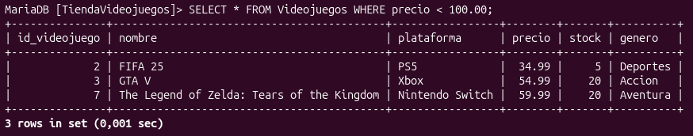
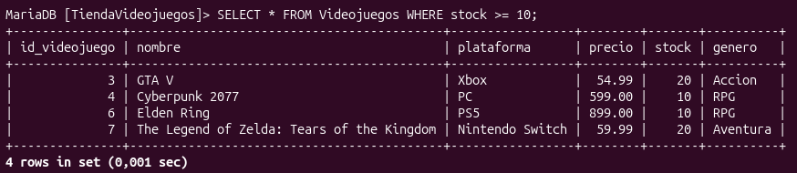
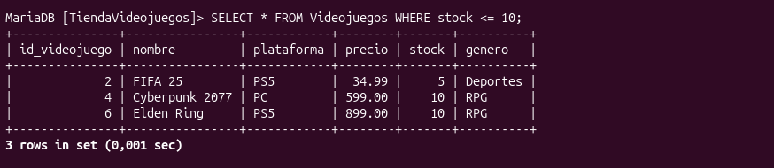
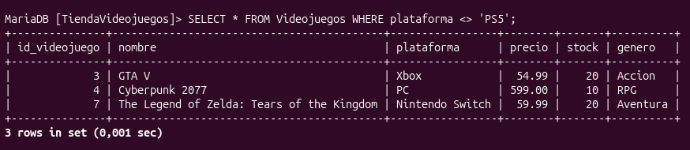
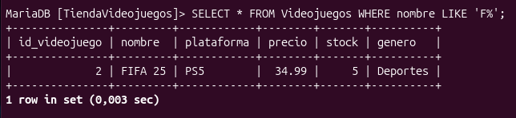
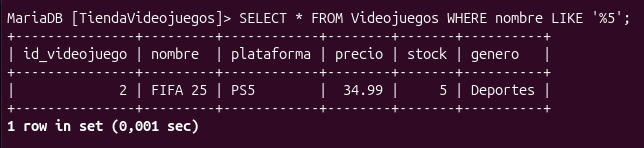
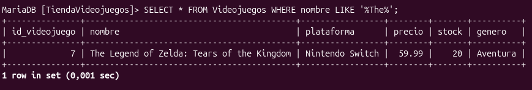
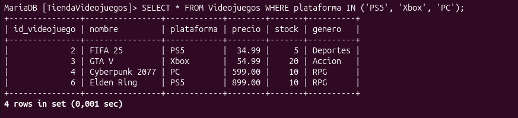
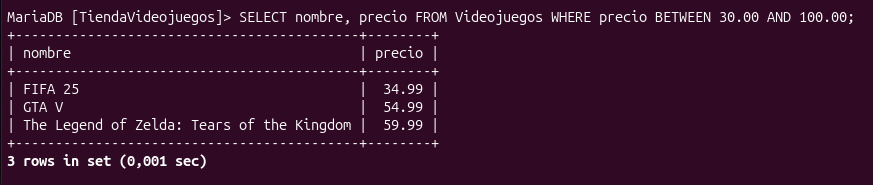
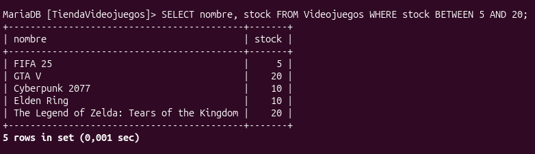

# 💻 Práctica 05 — Consultas SELECT

## 🎯 1. Objetivo

Convertir preguntas humanas y necesidades de negocio reales en consultas SQL precisas y eficientes utilizando el comando `SELECT` y sus diferentes cláusulas de filtrado, operadores lógicos, patrones de texto, rangos y ordenamiento. Aprender a ir más allá de la recuperación de tablas completas, enfocándose en extraer exactamente la información requerida para la toma de decisiones, aplicando buenas prácticas de sintaxis y analizando el comportamiento de los datos en un entorno de base de datos relacional (MySQL / MariaDB).

## 2. 🗄️ Base de datos utilizada

* **Nombre de la base de datos:** `TiendaVideojuegos`

* **Descripción:** Entorno relacional diseñado para administrar el inventario de un establecimiento comercial de videojuegos. Permite registrar catálogos por plataforma, control de precios, stock disponible y el registro de transacciones de venta bajo estrictas reglas de integridad referencial.

## 3. 📋 Tablas utilizadas

### 🎮 1. Tabla: `Videojuegos`
Almacena el catálogo general e inventario disponible de los artículos en la tienda.
* **Estructura y Tipos de Datos:**
  * `id_videojuego`: `int(11)` (Clave primaria, Auto_increment)
  * `nombre`: `varchar(100)` (Clave única, No nulo)
  * `plataforma`: `varchar(50)` (Permite nulos)
  * `precio`: `decimal(10,2)` (Permite nulos)
  * `stock`: `int(11)` (Valor predeterminado: 10)
  * `genero`: `varchar(50)` (Permite nulos)

### 🛒 2. Tabla: `Ventas`
Registra las transacciones comerciales vinculadas al catálogo de videojuegos.
* **Estructura y Tipos de Datos:**
  * `id_venta`: `int(11)` (Clave primaria, Auto_increment)
  * `id_videojuego`: `int(11)` (Clave foránea relacionada con el catálogo)
  * `cantidad`: `int(11)` (Permite nulos)
  * `fecha`: `date` (Permite nulos)
  
## 📊 4. SELECT básico

Se utilizó el comando `SELECT * FROM Videojuegos;` para seleccionar y mostrar todas las columnas disponibles en la tabla `Videojuegos`.

## 🎯 5. SELECT de columnas específicas

Se utilizó el comando `SELECT * FROM Videojuegos;` para seleccionar y mostrar todas las columnas disponibles en la tabla `Videojuegos`, y después se utilizó el comando `SELECT id_videojuego, nombre FROM Videojuegos;` para seleccionar y mostrar únicamente las columnas específicas de `id_videojuego` y `nombre` de los registros.

### 📝 Documenta

| Consulta | ¿Qué devuelve? |
| :--- | :--- |
| `SELECT *` | Muestra todas las columnas de la tabla |
| `SELECT columna1, columna2` | Muestra únicamente las columnas especificadas |

## 🔎 6. WHERE

Se utilizó el comando `SELECT * FROM Videojuegos WHERE plataforma = 'PS5';` para mostrar los registros de la tabla `Videojuegos` que coincida exactamente con `PS5` para obtener los juegos que le corresponden.

### 📝 INVESTIGACIÓN

¿Qué diferencia existe entre: `=` y: `LIKE`?
El operador `=` se utiliza para buscar coincidencias exactas.
El operador `LIKE` se utiliza para realizar busquedas aproximadas o patrones.

## 🔢 7. Operadores

**1. Operador Mayor que (>) [Punto A]**

¿Cuáles son los videojuegos del inventario cuyo precio es mayor a 100.00?

¿Qué significa el resultado?
Que solo existen dos títulos que su precio es mayor a 100.

**2. Operador Menor que (<) [Punto B]**

¿Cuáles son los juegos cuyo precio es menor a 100.00?

¿Qué significa el resultado?
Que solo hay dos titulos que su precio sea menor a 100.

**3. Operador Mayor o igual que (>=) [Punto C]**

¿Qué videojuegos cuentan con un stock disponible mayor o igual a 10 unidades?

¿Qué significa el resultado?
Que solo muestra los productos que tienen un stock mayor o igual a 10.

**4. Operador Menor o igual que (<=) [Punto D]**

¿Cuáles videojuegos tienen un stock menor o igual a 10 unidades?

¿Qué significa el resultado?
Muestra los productos que están por agotarse

**5. Operador Diferente de (<>) [Punto E]**

¿Cuáles videojuegos NO pertenecen a la plataforma de PS5?

¿Qué significa el resultado?
Excluye todos los juegos de una consola en especifico y muestra los demas.

## 🔤 8. LIKE

**A) Nombres que comiencen con una letra determinada**

**Explicación:**Filtra y devuelve únicamente los registros donde el título inicia con la letra "F".

**B) Nombres que terminen con una secuencia determinada**

**Explicación:**Muestra registros que terminen con el número "5".

**C) Nombres que contengan una palabra o fragmento**

**Explicación:**Muestra solo los registros que comiencen con "The".

## 📋 9. IN 

**¿Qué hace el operador `IN`?**
Permite buscar varios valores evitando escribir varios `OR`.

## 📏 10. BETWEEN

**A) Una consulta utilizando un rango numérico (Precios)**

`` `SELECT nombre, precio FROM Videojuegos WHERE precio BETWEEN 30.00 AND 100.00;` ``

**Explicación:** El operador `BETWEEN` simplifica la búsqueda dentro de un intervalo cerrado, evitando usar condiciones combinadas con operadores de mayor o menor igual.

**B) Una consulta utilizando otro rango que tenga sentido para tu proyecto (Stock)**

`` `SELECT nombre, stock FROM Videojuegos WHERE stock BETWEEN 5 AND 20;`
`` 
**Explicación:** Simplifica la busqueda de la cantidad de productos que quedan sin utilizar el mayor o menor igual.

**C) Comprobación de límites**

Valor inicial: 30.00

Valor final: 100.00

¿Se incluyó el inicial?: Sí

¿Se incluyó el final?: Sí 

Evidencia:

